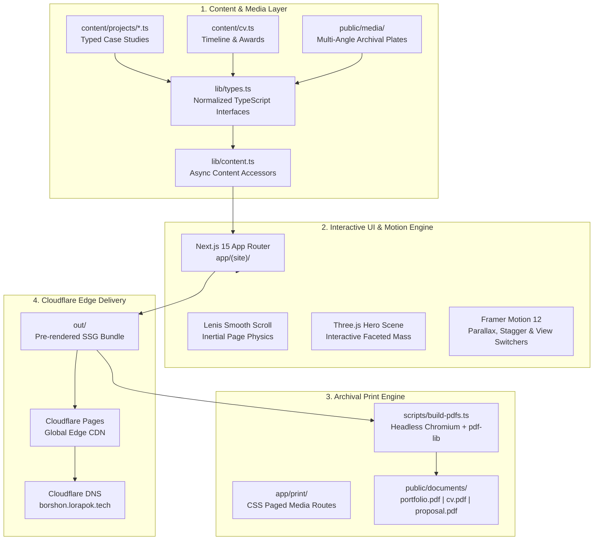

# Portfolio-System

> **Production-grade fine art portfolio, case study documentation, and print publication engine for Al-Sadik Borshon (Sculptor & 3D Artist).**

[](https://nextjs.org/)
[](https://www.typescriptlang.org/)
[](https://tailwindcss.com/)
[](https://www.framer.com/motion/)
[](https://threejs.org/)
[](https://pages.cloudflare.com/)

---

## 🏛️ Overview

**Portfolio-System** is an archival digital portfolio and print generation system designed specifically for sculptural, tactile, and monumental fine-art practices. Built with an editorial aesthetic, it treats digital presentation as an extension of museum curation—combining high-resolution multi-view photographic documentation, fluid typography, kinetic 3D moments, and a headless Chrome print pipeline that outputs matching 300 DPI vector PDFs.

The live web platform is deployed to the Cloudflare edge network at **[`borshon.lorapok.tech`](https://borshon.lorapok.tech)**.

---

## 📐 System Architecture



---

## ✨ Key Features & Architectural Modules

### 1. Dual-Target Publishing Pipeline
Every project entry and CV item is authored once in normalized TypeScript schemas (`lib/types.ts`) and simultaneously rendered into:
- **Interactive Web App**: Responsive, accessible, high-performance static website powered by Next.js 15 SSG.
- **Museum-Grade Print Documents**: Precision CSS Paged Media layouts rendered to PDF via Playwright and merged with running headers, footers, and page numbers via `pdf-lib`.

### 2. Multi-View Sculptural Case Studies
Unlike generic 2D gallery walls, three-dimensional sculptures require rotational understanding:
- **Terracotta Inlay Head (`terracotta-head`)**: 3-view triptych documenting frontal facial planes, lateral profile, and posterior terracotta shard mosaic inlay.
- **Cape Buffalo Head (`cape-buffalo-head`)**: 3-view study capturing full horn span, orbital ridge modeling, and academic course registration (`FAS-3102`).
- **Classical Female Torso (`female-torso`)**: Contrapposto life-modelling study across frontal, three-quarter, and posterior views.
- **Resting Canine Sculpture (`sleeping-dog`)**: 5-view recumbent clay study documenting anatomical massing, paw structure, clay fur tooling, and studio context.
- **Academic Life Studies (`tonal-life-studies`)**: Monumental kraft paper chiaroscuro drawings including unblurred frame extraction from 30fps studio video.

### 3. Biological UI & Motion Language
- **Inertial Kinetic Hero**: Custom Three.js scene featuring an icosahedron faceted mass with cursor-responsive directional lighting and smooth damping.
- **Editorial Scroll Physics**: Lenis smooth scrolling paired with Framer Motion spring-damped parallax reveals.
- **Interactive Multi-Angle View Switchers**: Smooth cross-fading between sculptural angles without page reloads.
- **Glassmorphic Navigation**: Floating blur header with top-edge reading progress indicator.

---

## 📂 Directory Structure

```
├── app/
│   ├── (site)/                  # Web portfolio routes (Home, Work, About, Contact, CV)
│   │   ├── page.tsx             # Editorial landing page with 3D hero & selected works
│   │   ├── layout.tsx           # Site layout with Lenis, Nav, Footer, and transitions
│   │   └── work/[slug]/         # Dynamic case study spreads
│   ├── print/                   # Paged-media print routes for headless PDF renderer
│   │   ├── portfolio/           # A4 landscape multi-page portfolio spread
│   │   ├── cv/                  # Two-column academic curriculum vitae
│   │   └── proposal/            # Commission & exhibition proposal document
│   ├── globals.css              # Design tokens, fluid typography, and CSS variables
│   └── layout.tsx               # Root document with next/font configuration
├── components/
│   ├── hero/                    # WebGL Three.js interactive scenes
│   ├── Figure.tsx               # Aspect-ratio locked archival image container
│   ├── ProjectCard.tsx          # Editorial grid card with asymmetric column spans
│   ├── ScrollReveal.tsx         # Viewport-triggered motion container
│   └── SmoothScroll.tsx         # Lenis scroll controller
├── content/
│   ├── projects/                # Individual project definitions (12 authentic projects)
│   ├── cv-projects.ts           # Chronological project registry
│   ├── artist.ts                # Artist statement, bio, contact details
│   └── site.ts                  # Metadata and global site configuration
├── lib/
│   ├── types.ts                 # Core TypeScript domain models
│   └── content.ts               # Async content accessors
├── public/
│   ├── documents/               # Recompiled production PDFs (portfolio.pdf, cv.pdf)
│   └── media/                   # Curated, color-calibrated photographic plates
├── scripts/
│   ├── build-pdfs.ts            # Headless Chrome PDF compilation script
│   └── verify-pdfs.ts           # PDF verification and size-budget checker
└── docs/
    └── roadmap.md               # Migration roadmap to Headless CMS & admin panel
```

---

## 🛠️ Technology Stack

| Domain | Technology | Purpose |
|---|---|---|
| **Framework** | Next.js 15 (App Router) | Static Site Generation (SSG), dynamic routes, image optimization |
| **Language** | TypeScript 5.7 | Strict type safety and data schema modeling |
| **Styling** | Vanilla CSS + Tailwind v4 | High-precision fluid typography, design tokens, print rules |
| **Motion** | Framer Motion 12 + Lenis | Smooth inertia scrolling, staggered reveals, spring transitions |
| **3D Graphics** | Three.js 0.172 | Custom WebGL interactive hero sculpture |
| **PDF Pipeline** | Playwright + pdf-lib | Headless Chromium print rendering with running page counters |
| **Edge Hosting** | Cloudflare Pages | Global edge CDN, zero-cold-start delivery, edge SSL |
| **DNS Management**| Cloudflare DNS | `borshon.lorapok.tech` CNAME configuration |
| **Security** | Secure Cred Vault | Passphrase-encrypted credential management (`cred`) |

---

## 🚀 Getting Started

### Prerequisites
- Node.js 20+ LTS
- Playwright Chromium browser:
  ```bash
  npx playwright install chromium
  ```

### Installation
```bash
git clone https://github.com/Maijied/Portfolio-System.git
cd Portfolio-System
npm install
```

### Local Development
```bash
npm run dev
```
Open [http://localhost:3000](http://localhost:3000) to view the portfolio.

### Building Static Site & PDFs
```bash
# Build static web export to out/
npm run build

# Compile print documents to public/documents/*.pdf
npm run pdfs

# Execute both in sequence
npm run build:all
```

---

## 🌐 Deployment & Edge DNS

Deployments are executed via Cloudflare Pages:
```bash
# 1. Source secure credentials from vault (no plain secrets)
eval "$(cred env cloudflare)"

# 2. Deploy static export
npx wrangler pages deploy out --project-name borshon-portfolio --branch main

# 3. DNS Configuration
# Subdomain: borshon.lorapok.tech
# Target: borshon-portfolio.pages.dev (Proxied through Cloudflare)
```

---

## 📜 License & Copyright

© 2024–2026 Al-Sadik Borshon. All artwork, photographic plates, and sculptural designs are copyrighted by the artist. Source code released under the [MIT License](LICENSE).
