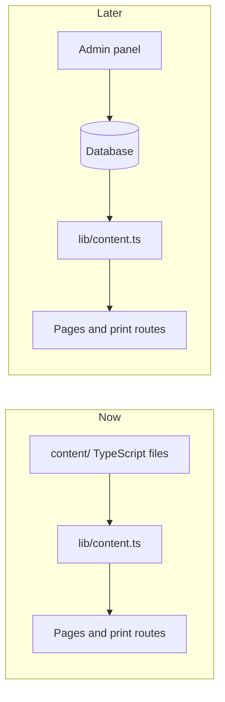

# Roadmap: from static export to CMS and admin panel

The site currently ships as a static export. Content lives in TypeScript files
under `content/` and every page reads it through `lib/content.ts`. That indirection
exists for exactly one reason: so this migration touches one file and no page
components.

Nothing described here is built yet. It is written down so the choices made now
do not have to be revisited later.

## Why the current setup is not a dead end

Every consumer of content already goes through an async function:

```ts
export async function getProjects(): Promise<Project[]> {
  return [...localProjects].sort((a, b) => b.order - a.order);
}
```

Pages `await` these. They do not know or care whether the data came from a file,
a database, or an HTTP call. The accessors are async today specifically so that
making them genuinely asynchronous later is not a breaking change.



## Stage 1 — switch to a server target

`next.config.mjs` currently sets `output: 'export'`. Removing that line is the
whole change, plus three consequences:

- **Images.** `images.unoptimized: true` can be dropped, which turns on the built-in
  optimiser. `components/Figure.tsx` uses a plain `` to keep the static export
  honest; move it to `next/image` at this point and delete the `sizes` prop
  workarounds.
- **Trailing slashes.** `trailingSlash: true` exists to make the exported directory
  structure serve correctly from any static host. Keep it or drop it, but decide
  before launch — changing it later invalidates every indexed URL.
- **PDF pipeline.** `scripts/build-pdfs.ts` serves `out/` over HTTP and prints from
  it. With a server target there is no `out/`, so point the script at the running
  server instead. The `serve()` helper becomes unnecessary rather than needing a
  rewrite.

## Stage 2 — move content into a database

Two viable options, and the choice matters less than usual because the accessor
boundary hides it:

| Option                       | Suits                                             | Cost                                                       |
| ---------------------------- | ------------------------------------------------- | ---------------------------------------------------------- |
| Postgres with Drizzle or Prisma | Full control, own the admin UI, no vendor account | You build the editing interface and image handling yourself |
| Sanity or Payload            | Editing UI, media library, and drafts out of the box | Schema lives in their format; another service to keep      |

Recommendation: **Postgres plus a hand-built admin panel**, for one reason specific
to this project. The content model in `lib/types.ts` is unusually shaped — nested
case-study sections, per-image aspect ratios, ordered timelines and budget tables.
Generic CMS interfaces handle that badly, and the artist will be editing project
case studies far more often than anything else.

Migration steps:

1. Translate `lib/types.ts` into schema. The types are already normalised enough to
   map directly: `projects`, `project_sections`, `media`, `education`, `exhibitions`,
   `awards`, `skill_groups`, `workshops`, `references`, and single-row `artist` and
   `proposal` tables.
2. Write a one-off seed script that imports `content/` and inserts it. The existing
   files become the initial dataset rather than being thrown away.
3. Replace the bodies in `lib/content.ts` with queries. Keep the signatures.
4. Delete `content/` only after the seed has been verified in production.

Keep `featuredMedia()` and `allMedia()` as they are — they are pure functions over
the returned shape and have no data source of their own.

## Stage 3 — the admin panel

Scope, in the order it should be built:

1. **Auth.** A single operator. Do not build user management for one user; a
   session-cookie login with a hashed password in the database is sufficient and
   has a smaller attack surface than an OAuth integration.
2. **Project CRUD.** The core of the panel. Needs section reordering and inline
   editing of `summaryShort`, `summaryLong`, and section bodies. The `order` field
   already exists so work can be promoted without renaming anything.
3. **Image upload.** Object storage — S3, R2, or equivalent — with the resulting
   key stored in the `media` table. Compute and store `aspect` on upload rather
   than asking the artist for it; the layout depends on it being correct.
4. **CV, statement, and proposal editing.** Plain long-form fields. Lower priority
   than projects because they change once or twice a year.
5. **Preview.** Draft state on projects plus a preview route. Worth doing, because
   the alternative is editing live.

Route the panel under `/admin` with middleware protecting the whole subtree, and
keep it out of the public sitemap.

## Stage 4 — regenerate documents on publish

Once content is editable, the PDFs in `public/documents/` go stale silently, which
is worse than them being obviously absent. On publish:

1. Enqueue a job rather than blocking the request — a Playwright run takes seconds,
   not milliseconds.
2. Print the three `/print/*` routes from the running server.
3. Write the results to object storage, not the repo, and serve them from there.
   `content/site.ts` already routes every download through a `documents` array, so
   this is a change to those `href` values.

The print routes need no changes at all. They read through the same accessors as
everything else, which is the point of the whole arrangement.

## Things to decide before launch, not after

- **Domain.** `content/site.ts` has `url: 'https://example.com'`. This feeds
  canonical URLs and Open Graph tags.
- **Trailing slash policy.** As above. Cheap now, expensive later.
- **Analytics.** If any is wanted, add it before there is traffic worth comparing
  against.
- **Image dimensions.** The static export serves whatever file is dropped into
  `public/media/`. Until Stage 1 turns on the optimiser, oversized exports are
  downloaded at full size. See `public/media/README.md`.
